# Car Rental App


API REST e interface web para gerenciamento de locadora de veículos.

Desenvolvi esse projeto a partir de uma conversa com o dono de uma locadora pequena que controlava tudo em planilhas do Excel — qual carro estava disponível, quem tinha alugado, quilometragem de saída e retorno. O sistema nunca chegou a ser implantado, mas serviu de base pra eu estruturar uma aplicação com as preocupações que aparecem em projetos reais: race condition no momento do aluguel, cálculo de multa na devolução, controle de acesso por papel em ambas as camadas e soft delete pra preservar histórico sem perder os dados.

---

## Funcionalidades

- Cadastro de marcas, linhas e veículos com filtros e busca
- Cadastro de clientes com validação de CPF
- Criação de locação com verificação de disponibilidade em transação atômica
- Registro de devolução com cálculo automático de multa por atraso
- Controle de acesso por papel (admin / operador)
- Gerenciamento de usuários pelo painel (criar, promover, revogar papel)
- Soft delete em todas as entidades — histórico preservado
- 81 testes automatizados no backend, 42 no frontend

---

## Telas

**Dashboard** — locações ativas em destaque com alerta visual para devolução em atraso

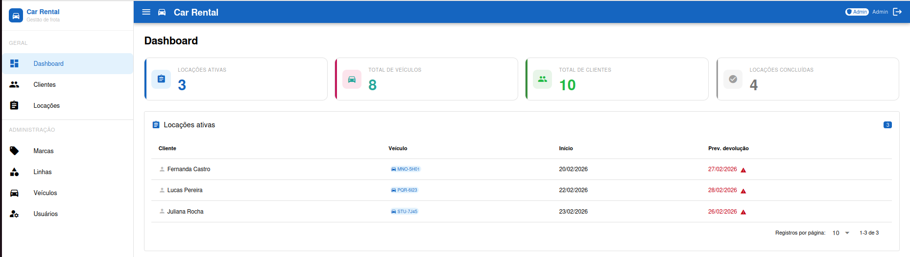

**Locações** — criação de locação, registro de devolução e cálculo de multa

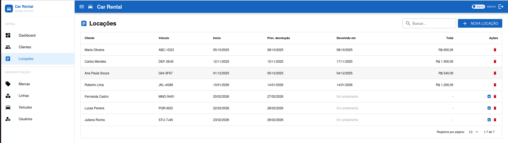

**Clientes**

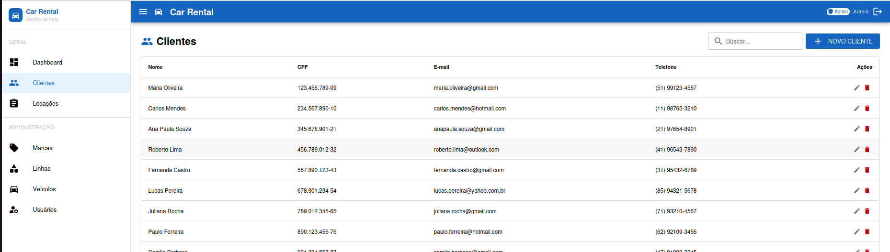

**Veículos**

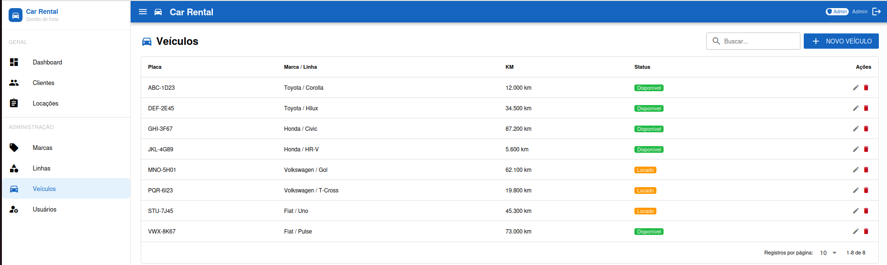

**Marcas**

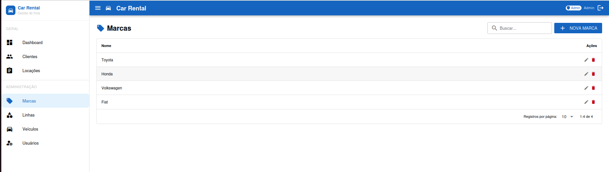

**Linhas**

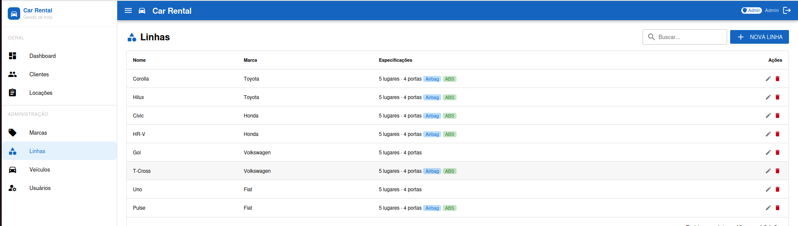

**Usuários** — admin pode criar usuários, promover e revogar papel; não pode alterar o próprio papel

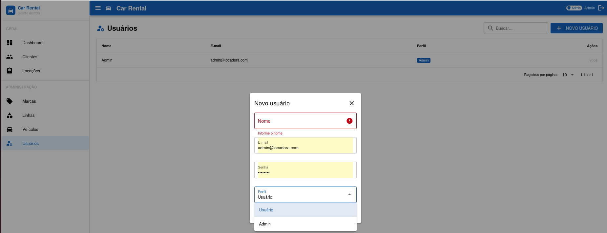

---

## Arquitetura

Monorepo com backend e frontend servidos de forma independente.

```
car-rental-app/
├── backend/    # API Laravel 12 (porta 8001)
└── frontend/   # Interface Quasar v2 + Vue 3 (porta 9000)
```

### Visão Geral

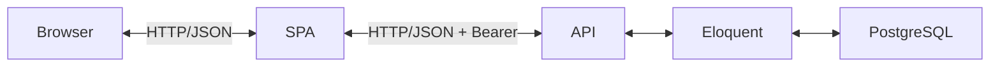

### Fluxo de Requisição

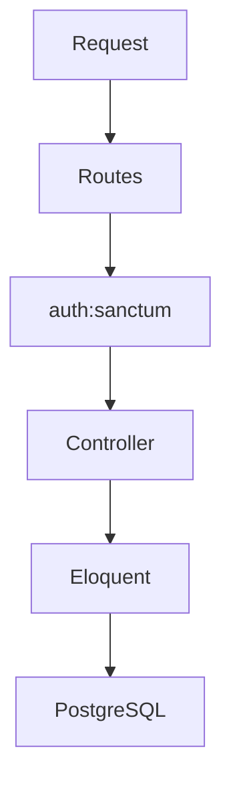

### Fluxo de Autenticação

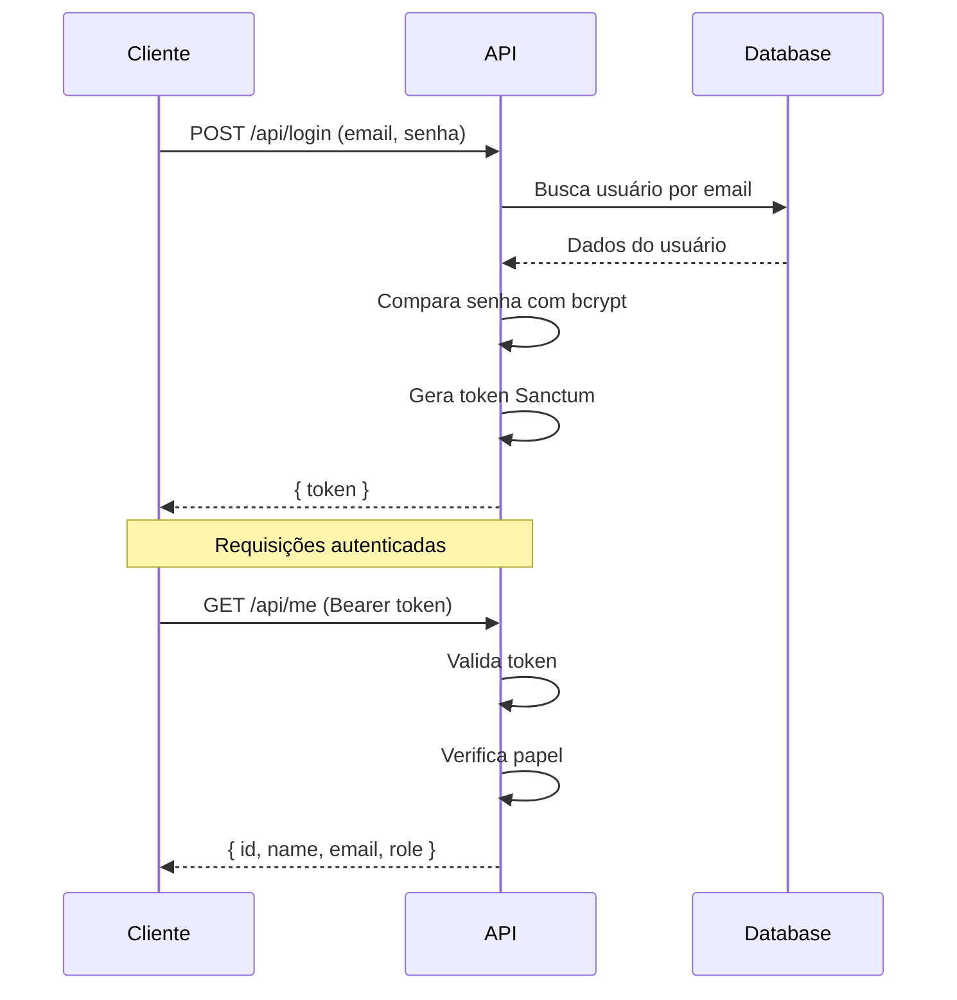

---

## Modelo de Dados

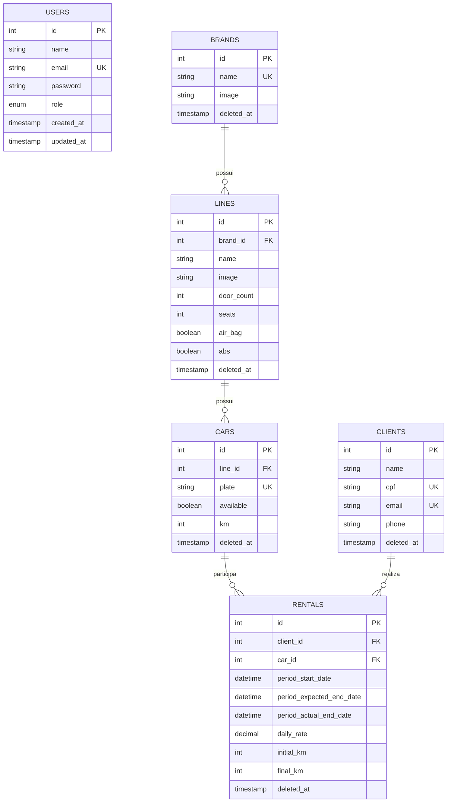

---

## Tecnologias

**Backend**

- PHP 8.3 + Laravel 12
- Laravel Sanctum — autenticação por Bearer token
- Dedoc Scramble — documentação OpenAPI a partir do código
- PostgreSQL 16 em produção, SQLite in-memory para testes
- PHPUnit 11, Laravel Pint

**Frontend**

- Vue 3 + Quasar v2 (Composition API, `<script setup>`)
- Pinia — estado global com persistência em localStorage
- Axios com interceptors — injeção de token e redirecionamento automático em 401
- Vitest + @vue/test-utils

**CI**

- GitHub Actions — Pint + PHPStan + testes a cada push em `master`

---

## Instalação

**Pré-requisitos:** PHP 8.3+, Composer, Node 20+, PostgreSQL 16

Crie o banco de dados:

```bash
createdb locadora
```

**Backend:**

```bash
cd backend
composer install
cp .env.example .env
# edite DB_PASSWORD no .env
php artisan key:generate
php artisan migrate --seed
```

**Frontend:**

```bash
cd frontend
npm install
```

Crie `frontend/.env`:

```env
API_URL=http://localhost:8001/api
```

---

## Rodando

**Terminal 1:**

```bash
cd backend && php artisan serve --port=8001
```

**Terminal 2:**

```bash
cd frontend && npm run dev
```

Acesse `http://localhost:9000`

Login padrão: `admin@locadora.com` / `senha123`

---

## Testes

```bash
# backend — SQLite in-memory, não precisa do PostgreSQL configurado
cd backend && php artisan test

# frontend
cd frontend && npm test
```

---

## Controle de Acesso

| Papel | Permissões |
|-------|------------|
| `admin` | Acesso total — marcas, linhas, veículos, clientes, locações e gerenciamento de usuários |
| `operador` | Clientes e locações. Sem acesso ao cadastro de frota nem à gestão de usuários |

O papel padrão ao registrar via `/api/register` é `operador`. Novos usuários com papel específico só podem ser criados por um admin via painel ou `POST /api/users`.

Um admin não pode alterar o próprio papel — a proteção está no backend e é refletida na interface (o botão de ação não aparece para o próprio usuário autenticado).

---

## Regras de Negócio

- Carro indisponível → 422 ao tentar criar locação
- Disponibilidade verificada dentro de uma transação para evitar race condition
- `final_km` menor que `initial_km` → 422
- Data de devolução anterior à data de início → 422
- Deletar carro ou cliente com locação em aberto → 422
- Multa por atraso: `dias_de_atraso × diária × 0.5`
- Todas as entidades usam soft delete — nada é removido fisicamente do banco

---

## Licença

MIT
